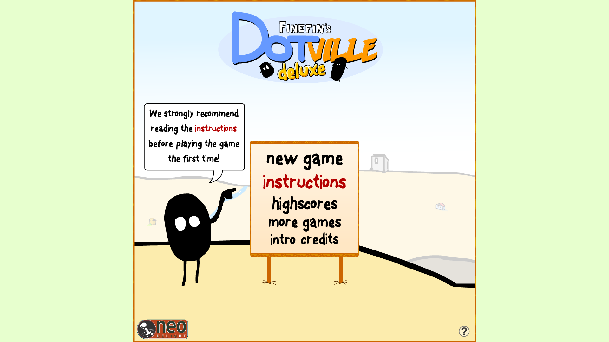

# Shape Ville

## About This Project
A mild interpretation of an older flash game that doesn't appear to be loved as much anymore.
[play here](./sourceReferances/game/)

Manage a city of dot-like people against the aggressive squares.

Start with the classic 50 turn mode, or extend your play with harder difficulties which increase the number of raids to survive.

Keep your dots fed, armed, and preocupied in the machines of your expanding empire. Tax them to earn for your keep, grant them every luxury you can so you may claim to be emperor of the Dots!

## The Aim

Create a loose replica with some additional features

    - different levels of difficulty
    - a more varied marketplace/product chain
    - extended gameplay
    - (!Warning Ambitious!) Networking to compete with friends like a board game
    - varried shapes or races to choose from for diffrent start economies
    - 3 slot save file
    - map of expanding area(auto fills based on what is owned already, no agency)
        - limited map expansion area
    - the Everything support (win, mac, linux, web)
    

## Neworking Layout

- server
    - hosts game world and status
    - recieves player session as a JSON
    - waits for full submition of moves before turning over
    - applies market price updates
    - calcs scarcity
    - generates a world, numerically with limited space for industry.
- client
    - connects to server at IP or publicly hosted site
    - can play offline for classic campaign
    - can create a save file for reloading as host or offline play
        